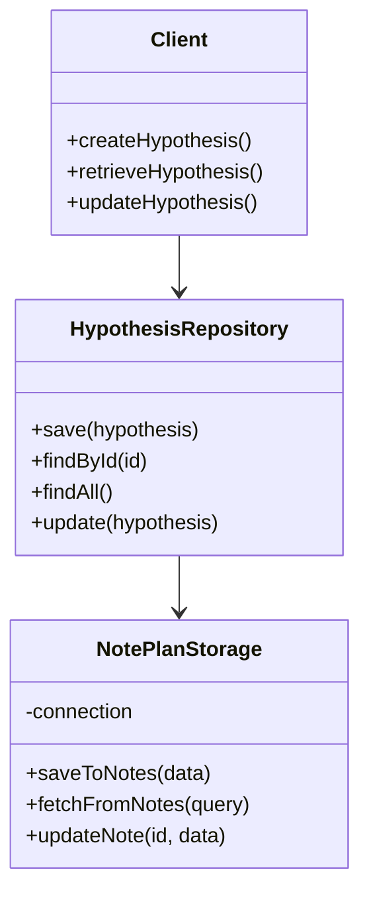
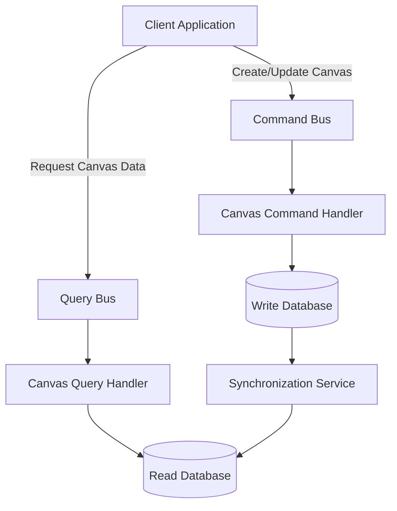
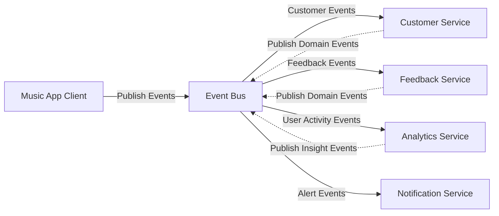

# 100 - Customer Discovery

### NotePlan - Repository Pattern

### StoriesOnBoards - CQRS Pattern (Command Query Responsibility Segregation)

### Flowlu - Event-Driven Architecture

### ActivePieces - Pipes and Filters Pattern

### Visual Studio Code - Plugin Architecture Pattern

### GitHub - Gitflow Workflow Pattern

### Cursor.io - AI-Enhanced Middleware Pattern

## 100 - Define Your Vision and Hypotheses

See [README.md](./100/README.md)

## 200 - Identify Customer Problems

See [README.md](./200/README.md)

## 300 - Test Problem Hypotheses

See [README.md](./300/README.md)

## 400 - Develop a Minimum Viable Product (MVP)

See [README.md](./400/README.md)

## 500 - Iterate based on Feedback

See [README.md](./500/README.md)
